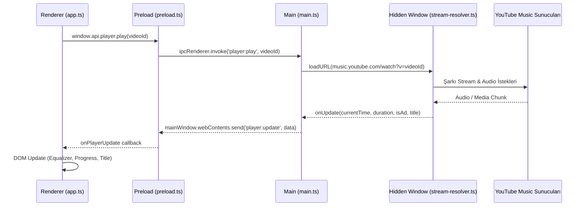

# 📐 01. Mimari ve Sistem Tasarımı

> **Aquality Music Mimari Referansı**  
> Projenin süreç modeli, güvenlik sınırları, IPC sözleşmeleri ve dizin mimarisinin kapsamlı analizi.

---

<!-- AUTO-UPDATE:STATUS-START -->
| Sistem Parametresi | Değer / Durum |
|---|---|
| **Son Güncelleme** | `2026-09-12 00:03` |
| **Proje Sürümü** | `v1.0.0` (Masaüstü: `v1.0.0`, Web: `v1.0.0`) |
| **Git Dalı (Branch)** | `master` |
| **Son Commit** | `267136d - chore(mobile): add monorepo metro config and root tunnel scripts (10 minutes ago)` |
| **TypeScript Derleme Sağlığı** | ✅ BAŞARILI (Masaüstü Main + Renderer + Mobil Expo Hatasız) |
| **Takip Edilen Sorunlar** | 21 / 21 Çözüldü (%100 Başarı) |
<!-- AUTO-UPDATE:STATUS-END -->

---

## 1. Çoklu Süreç (Multi-Process) Mimarisi

Aquality Music, modern Electron ve Chromium güvenlik mimarisini temel alır. Uygulama üç ana yürütme ortamına ayrılmıştır:



### 1.1 Ana Süreç (`desktop/src/main/main.ts`)
- **İşletim Sistemi Köprüsü**: Pencere yönetimi, menü kontrolleri, sistem tepsisi (tray) ve küresel kısayollar.
- **İzole API Yürütücüsü**: InnerTube HTTP istekleri, token saklama, çerez yönetimi ve dosya sistemi I/O işlemleri yalnızca burada gerçekleşir.
- **Güvenlik Çiti**: Renderer sürecinin doğrudan Node.js ortamına veya dosya sistemine erişimi kesinlikle engellenmiştir (`nodeIntegration: false`, `contextIsolation: true`).

### 1.2 Ön Yükleme Süreci (`desktop/src/main/preload.ts`)
- **`contextBridge` Kullanımı**: Yalnızca onaylanmış fonksiyonları güvenli bir şekilde `window.api` nesnesi altında `contextBridge.exposeInMainWorld` ile dışa açar.
- **IPC Sözleşmesi**: Renderer ve Main süreçleri arasındaki tüm mesajlaşma tip güvenli `ipcRenderer.invoke` ve `ipcRenderer.on` çağrıları ile yönetilir.

### 1.3 Gizli Oynatma Süreci (`desktop/src/main/api/stream-resolver.ts`)
- Görünmez bir `BrowserWindow` oluşturulur (`show: false`).
- YouTube Music web oynatıcısının yerel codec, token şifre çözme ve DRM/koruma zincirini doğal olarak çalıştırmasını sağlar.
- Reklam domainleri ağ seviyesinde iptal edilir, DOM reklam elementleri CSS ile gizlenir, reklam videoları tespit edildiğinde süresi sona çekilerek 0 saniyede geçilir.

---

## 2. IPC İletişim Sözleşmesi (IPC Contract)

Ana süreç ile Renderer süreci arasındaki tüm haberleşme kanalları şunlardır:

| Kanal Adı | Türü | Açıklama |
|---|---|---|
| `auth:login` | `invoke` | YouTube Music giriş penceresini açar. |
| `auth:logout` | `invoke` | Oturum çerezlerini temizler ve çıkış yapar. |
| `auth:status` | `invoke` | Giriş durumunu ve kullanıcı profil bilgilerini döndürür. |
| `youtube:search` | `invoke` | Belirtilen sorgu ve filtreye göre InnerTube araması yapar. |
| `youtube:home` | `invoke` | Ana sayfa öneri raflarını ve albümlerini çeker. |
| `youtube:artist` | `invoke` | Sanatçı profilini, popüler şarkılarını ve albümlerini ayrıştırır. |
| `youtube:album` | `invoke` | Albüm parça listesini ve kapak görselini getirir. |
| `youtube:playlist` | `invoke` | Çalma listesi şarkılarını ve metadata'sını getirir. |
| `player:play` | `invoke` | Gizli pencerede ilgili `videoId` oynatmasını başlatır. |
| `player:pause` | `invoke` | Şarkıyı duraklatır. |
| `player:resume` | `invoke` | Duraklatılan şarkıyı devam ettirir. |
| `player:seek` | `invoke` | Belirtilen saniyeye atlar. |
| `player:volume` | `invoke` | Ses seviyesini ayarlar (%0 - %100). |
| `player:update` | `send` | Oynatma zamanı, süresi, reklam durumu ve şarkı bilgisini renderer'a yayınlar. |
| `store:get` / `store:set` | `invoke` | Kalıcı kullanıcı verilerini (`electron-store`) okur ve yazar. |
| `discord:updateActivity` | `invoke` | Discord Rich Presence durumunu günceller. |

---

## 3. Güvenlik Tasarımı ve İlkeleri

1. **Context Isolation**: Renderer süreci asla doğrudan Electron/Node.js API'lerine erişemez.
2. **Web Güvenliği & CSP**: `index.html` içinde katı Content Security Policy uygulanır:
   ```html
   <meta http-equiv="Content-Security-Policy" content="default-src 'self' https:; img-src 'self' https: data:; media-src 'self' https: blob:; style-src 'self' 'unsafe-inline' https://fonts.googleapis.com; font-src 'self' https://fonts.gstatic.com; script-src 'self' 'unsafe-inline';">
   ```
3. **Güvenli Harici URL Filtresi (`isSafeExternalUrl`)**: Kullanıcı arayüzünden açılmak istenen tüm dış bağlantılar yalnızca `https://` protokolüne ve onaylı alan adlarına (`google.com`, `youtube.com`, `discord.com`, `github.com`) izin verir; `file://`, `javascript:`, `data:` gibi tehlikeli şemalar engellenir.
4. **HTML / DOM Enjeksiyon Koruması (`escapeHtml`)**: Şarkı adları, sanatçı isimleri, albümler ve çalma listeleri DOM'a basılmadan önce tüm özel karakterler (`&`, `<`, `>`, `"`, `'`) filtrelenir.
