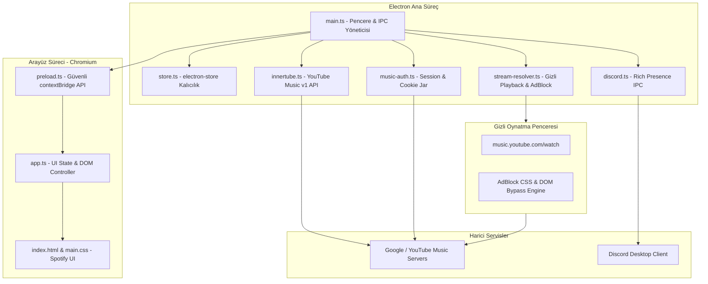

# 🎵 Aquality Music — Kapsamlı Dokümantasyon Portalı

> **Canlı & Otomatik Güncellenen Dokümantasyon Sistemi**  
> Bu sistem projedeki her derlemede (`npm run build`), geliştirme başlangıcında (`npm run dev`), commit işleminde (`post-commit` hook) ve `npm run docs:update` komutunda dinamik olarak güncellenir.

---

<!-- AUTO-UPDATE:STATUS-START -->
| Sistem Parametresi | Değer / Durum |
|---|---|
| **Son Güncelleme** | `2026-09-19 14:49` |
| **Proje Sürümü** | `v1.0.2` (Masaüstü: `v1.0.2`, Web: `v1.0.2`) |
| **Git Dalı (Branch)** | `master` |
| **Son Commit** | `b2dba57 - fix(desktop): restore robust hybrid google login with login-preload, CDP, and fallback options (0 seconds ago)` |
| **TypeScript Derleme Sağlığı** | ✅ BAŞARILI (Masaüstü Main + Renderer + Mobil Expo Hatasız) |
| **Takip Edilen Sorunlar** | 24 / 24 Çözüldü (%100 Başarı) |
<!-- AUTO-UPDATE:STATUS-END -->

---

## 📚 Dokümantasyon Modülleri Haritası

Aşağıdaki bağlantılar projenin tüm katmanlarını derinlemesine inceleyen modüler dokümanlara yönlendirir:

| No | Modül Belgesi | Kapsam ve Açıklama |
|---|---|---|
| 01 | [01. Mimari ve Sistem Tasarımı](01-MIMARI-VE-SISTEM-TASARIMI.md) | Electron çoklu süreç (Main, Renderer, Hidden Window), IPC köprüsü ve güvenlik izolasyonu. |
| 02 | [02. API ve Stream Motoru](02-API-VE-STREAM-MOTORU.md) | InnerTube v1 YouTube Music API, gizli arka plan stream resolver, ağ düzeyinde adblocker ve Discord RPC. |
| 03 | [03. Kimlik Doğrulama ve Güvenlik](03-AUTH-VE-GUVENLIK.md) | YouTube Music session çerezleri, Chromium Client Hints spoofing, Google/Discord OAuth, XSS önlemleri. |
| 04 | [04. Renderer ve Arayüz Tasarımı](04-RENDERER-VE-ARAYUZ.md) | `app.ts` tek sayfa state yönetimi, Spotify standardı karanlık UI, canlı ekolayzır, kuyruk ve i18n dil sistemi. |
| 05 | [05. Veri Yönetimi ve Store](05-VERI-STORE-VE-DURUM.md) | `electron-store` kalıcılık şeması, son çalınanlar, beğenilenler, pencere boyutları ve çarpışmasız ID üretimi. |
| 06 | [06. Paketleme ve Dağıtım](06-PAKETLEME-VE-DAGITIM.md) | `electron-builder` yapılandırması, NSIS kurulum sihirbazı, Portable mod veri izolasyonu (`PORTABLE_EXECUTABLE_DIR`). |
| 07 | [07. Web Sitesi ve Dağıtım](07-WEB-SITESI-VE-SEO.md) | Vite çok sayfalı web sitesi, otomatik OS indirme yönlendirmesi, SEO, `robots.txt`, `sitemap.xml`, yasal metinler. |
| 08 | [08. Sorunlar ve Çözümler Matrisi](08-SORUNLAR-VE-COZUMLER.md) | `SEC-01` ile `PKG-02` arasındaki 21 sorunun kök neden analizi (RCA), uygulanan çözümler ve durum matrisi. |
| 09 | [09. Geliştirici Kılavuzu](09-GELISTIRICI-KILAVUZU.md) | Kurulum adımları, geliştirme ortamı, derleme komutları, hata ayıklama ipuçları ve terminal kılavuzu. |
| 10 | [10. Mobil (Expo - Android & iOS) Rehberi](10-MOBIL-EXPO-REHBERI.md) | React Native (Expo) ile Android APK ve iOS derleme, kilit ekranı ses servisi, navigasyon ve EAS Build. |
| 11 | [11. Discord Bot ve RPC Entegrasyonu](11-DISCORD-BOT-VE-RPC-ENTEGRASYONU.md) | Aquality & Harmonic Discord Botu, Canvas oynatıcı kartı motoru, Port 9863 REST API ve dinamik öneriler. |
| 🔬 | [**Kapsamlı Proje Denetim ve Sorun Suiti (Audit)**](audit/00-OZET-VE-GELISMIS-SORUN-INDEKSI.md) | **38 Yeni Sorun, Tüm Klasör ve Dosyaların Ayrı Ayrı Teknik Dokümantasyonu (39 Bağımsız Rapor).** |
| 🔍 | [**KAPSAMLI PROJE ANALIZI (47 Sorun)**](00-PROJE-KAPSAMLI-ANALIZ.md) | **Tüm platformlarda 47 sorun tespit edildi. Detaylı analiz, kök neden ve çözüm önerileri.** |
| 📊 | [**KAPSAMLI SORUN ANALIZI (202 Sorun)**](KAPSAMLI-SORUN-ANALIZI.md) | **Tüm modüllerde 202 sorun tespit edildi. KRİTİK: 14, YÜKSEK: 36, ORTA: 70, DÜŞÜK: 82.** |
| 🖥️ | [Desktop Sorunları (50)](DESKTOP-SORUNLARI.md) | **Electron masaüstü uygulaması: 6 KRİTİK, 6 YÜKSEK, 19 ORTA, 19 DÜŞÜK.** |
| 📱 | [Mobile Sorunları (34)](MOBILE-SORUNLARI.md) | **Expo/React Native mobil uygulama: 2 KRİTİK, 5 YÜKSEK, 14 ORTA, 13 DÜŞÜK.** |
| 🌐 | [Website Sorunları (50)](WEBSITE-SORUNLARI.md) | **Vite web sitesi: 3 KRİTİK, 11 YÜKSEK, 15 ORTA, 21 DÜŞÜK.** |
| ⚙️ | [CI/CD Sorunları (40)](CICD-SCRIPTS-SORUNLARI.md) | **CI/CD, scripts ve yapılandırma: 3 KRİTİK, 8 YÜKSEK, 13 ORTA, 16 DÜŞÜK.** |
| 📝 | [Dokümantasyon Sorunları (28)](DOKUMANTASYON-SORUNLARI.md) | **Dokümantasyon tutarsızlıkları: 6 YÜKSEK, 9 ORTA, 13 DÜŞÜK.** |
| 🔒 | [Güvenlik Sorunları (SEC)](SEC-GUVENLIK-SORUNLARI.md) | 9 güvenlik açığı: WebView, XSS, token sızıntısı, CSP bypass |
| 🏗️ | [Mimari ve Kod Sorunları (ARC)](ARC-MIMARI-KOD-SORUNLARI.md) | 12 mimari/kod sorunu: TypeScript hataları, memory leak, type safety |
| ⚡ | [Performans Sorunları (PERF)](PERF-PERFORMANS-SORUNLARI.md) | 7 performans sorunu: CPU kullanımı, polling, I/O |
| 🛡️ | [Hata Yönetimi Sorunları (REL)](REL-HATA-YONETIMI-SORUNLARI.md) | 8 hata yönetimi sorunu: null safety, error handling |
| 📱 | [Mobil Uygulama Sorunları (MOB)](MOBIL-SORUNLAR.md) | 6 mobil sorun: TypeScript, dependency, WebView |
| 🔧 | [CI/CD Sorunları (OPS)](CI-CD-SORUNLARI.md) | 3 CI/CD sorunu: typecheck, version sync |
| 🌐 | [Website Sorunları (WEB)](WEB-SORUNLARI.md) | 2 website sorunu: responsive, memory leak |

---

### 📂 Ayrı Ayrı Dosya ve Klasör Denetim Dokümanları (`docs/audit/`)

- 📑 [Genel Denetim ve Master Sorun İndeksi](audit/00-OZET-VE-GELISMIS-SORUN-INDEKSI.md)
- 🖥️ **Masaüstü Ana Süreç (`desktop-main/`)**:
  [Klasör Analizi](audit/desktop-main/00-klasor-analizi.md) • [main.ts](audit/desktop-main/main.ts.md) • [preload.ts](audit/desktop-main/preload.ts.md) • [innertube.ts](audit/desktop-main/api-innertube.ts.md) • [stream-resolver.ts](audit/desktop-main/api-stream-resolver.ts.md) • [music-auth.ts](audit/desktop-main/auth-music-auth.ts.md) • [google-oauth.ts](audit/desktop-main/auth-google-oauth.ts.md) • [discord-oauth.ts](audit/desktop-main/auth-discord-oauth.ts.md) • [lib-discord-rpc](audit/desktop-main/lib-discord-rpc.md) • [providers](audit/desktop-main/providers.md) • [store.ts](audit/desktop-main/utils-store.ts.md) • [discord.ts](audit/desktop-main/utils-discord.ts.md)
- 🎨 **Masaüstü Arayüz (`desktop-renderer/`)**:
  [Klasör Analizi](audit/desktop-renderer/00-klasor-analizi.md) • [components/app.ts](audit/desktop-renderer/components-app.ts.md) • [index.html](audit/desktop-renderer/index.html.md) • [styles.md](audit/desktop-renderer/styles.md)
- 📱 **Mobil Uygulama (`mobile/`)**:
  [Klasör Analizi](audit/mobile/00-klasor-analizi.md) • [Sayfalar ve Rotalar](audit/mobile/app-routes.md) • [innertube.ts](audit/mobile/api-innertube.ts.md) • [services/player.ts](audit/mobile/services-player.ts.md) • [player-store.ts](audit/mobile/store-player-store.ts.md) • [Bileşenler](audit/mobile/components.md) • [Yapılandırma](audit/mobile/configs-and-build.md)
- 🌐 **Web Sitesi (`website/`)**:
  [Klasör Analizi](audit/website/00-klasor-analizi.md) • [HTML Sayfaları](audit/website/html-pages.md) • [JS ve CSS](audit/website/js-and-css.md) • [Vite ve SEO](audit/website/config-and-seo.md)
- ⚙️ **Altyapı ve CI/CD (`infra-and-scripts/`)**:
  [Klasör Analizi](audit/infra-and-scripts/00-klasor-analizi.md) • [Scriptler](audit/infra-and-scripts/scripts.md) • [CI/CD İş Akışları](audit/infra-and-scripts/ci-cd-workflows.md) • [Masaüstü Configs](audit/infra-and-scripts/desktop-configs.md) • [Kök Dosyalar](audit/infra-and-scripts/root-configs.md)
- 🧩 **Kategorik Sorun Katalogları (`kategorik-sorunlar/`)**:
  [Güvenlik (SEC)](audit/kategorik-sorunlar/SEC-guvenlik-ve-gizlilik.md) • [Mimari (ARC)](audit/kategorik-sorunlar/ARC-mimari-ve-kod-borcu.md) • [Performans (PERF)](audit/kategorik-sorunlar/PERF-performans-ve-kaynak.md) • [Kararlılık (REL)](audit/kategorik-sorunlar/REL-kararlilik-ve-hata-yonetimi.md) • [UX/UI](audit/kategorik-sorunlar/UX-kullanici-deneyimi-ve-ui.md) • [Dağıtım & CI (OPS)](audit/kategorik-sorunlar/OPS-paketleme-dagitim-ve-ci.md)

---

## 🏗️ Üst Düzey Sistem Mimarisi

---

## 🔄 Otomatik Güncelleme Sistemi Nasıl Çalışır?

Bu dokümantasyon klasöründeki veriler statik değildir. Proje üzerinde yapılan her çalışmada otomatik olarak güncellenir:

1. **`npm run dev` Öncesi**: `predev` kancası `node scripts/update-docs.cjs` çalıştırır.
2. **`npm run build` Öncesi**: `prebuild` kancası tüm TypeScript kontrollerini ve commit metriklerini günceller.
3. **Git Commit Sonrası**: `.git/hooks/post-commit` tetiklenerek commit hash'i, değişen dosyalar ve sağlık raporu işlenir.
4. **Manuel Güncelleme**: İstediğiniz an terminalde `npm run docs:update` çalıştırabilirsiniz.
